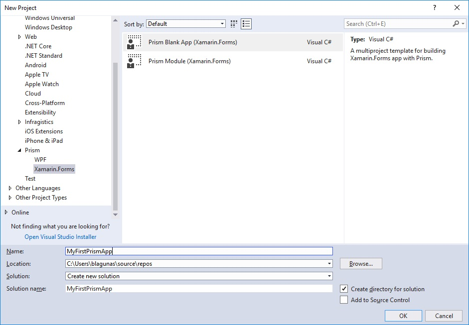
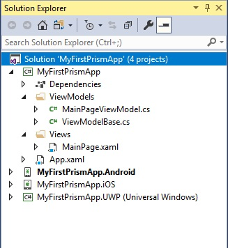
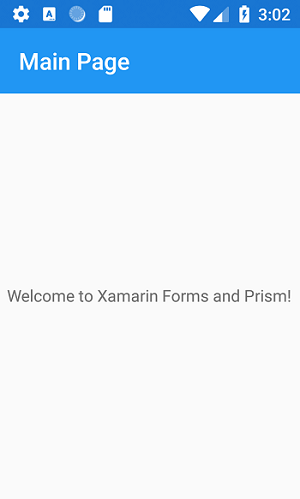

# Creating Your First Prism App
In this topic, we will walk through the necessary steps required to create a new Xamarin.Forms application using the Prism Library.

> [!Video https://www.youtube.com/embed/81Q2fxFWIqA]

## Create the Application

First, make sure you have installed the Prism Template Pack.

Now that you have the Prism Template Pack installed, lets create a new solution. Go to `File > New > Project...` select `Installed > Visual C# > Prism`. Here you will find all the templates available for a new Prism project/solution.



Select `Prism Blank App (Xamarin.Forms)` and fill in the name of your project/solution and click OK. In the example, I named the solution "MyFirstPrismApp".

Next, select your target platforms and which container you would like to use. In this example, we are targeting Android, iOS, and UWP, and we are using the DryIoC dependency injection container.


A new solution was created with a .NET Standard project for all the shared code, and platform-specific projects (Android, iOS, Windows Phone). All appropriate NuGet packages were added to these projects for Xamarin.Forms and Prism along with all their dependencies.



## Run the App

**Android**

Right click on the Android project and set it as the startup project. Also ensure build and deploy are both checked for the Android project in the Configuration Manager.

You may also need to:
- Open the Xamarin Android Player and ensure that a device image is installed and note the API level of the device image.
- Open the Android project properties and change the Minimum Android to target to be equal or less than the API level of the device image you will be running on.

Select the Android Player device from the Debug drop down menu and click the debug play button (or press F5).

**iOS**

_This is for Visual Studio (on Windows):_

First make sure that there's a connection with the Xamarin Mac Agent.

Right click on the iOS project and select set as startup project. Also ensure build and deploy are both checked for the iOS project in the Configuration Manager.

To run the application on a iOS simulator, the build configuration should be set to "iPhoneSimulator".

For running the application on a physical iOS device, there must be a connected iOS device to the PC. The build configuration needs to be set on "iPhone" (even for testing with an iPad).  If there is only one iOS device attached to the PC it will select it by default. When there are multiple iOS devices attached, you must select with device you want to run on.

Select the device from the Debug drop down menu and click the debug play button (or press F5).



## Anatomy of a Prism Application
Let's take a look at the Prism application we just created to understand the parts and how it all works.

### App.cs
The `App.xaml` and `App.xaml.cs` files are the entry point of the application. The XAML markup in the `App.xaml` file is simple, and defines the application as a `PrismApplication`.
```xml
<prism:PrismApplication xmlns="http://xamarin.com/schemas/2014/forms"
             xmlns:x="http://schemas.microsoft.com/winfx/2009/xaml"
             xmlns:prism="http://prismlibrary.com"
             x:Class="MyFirstPrismApp.App">
  <Application.Resources>
    <!-- Application resource dictionary -->
  </Application.Resources>
</prism:PrismApplication>
```

The `App.xaml.cs` file contains the logic required to configure a Prism application and navigate to the root page on start up.
```cs
    public partial class App
    {
        /*
         * The Xamarin Forms XAML Previewer in Visual Studio uses System.Activator.CreateInstance.
         * This imposes a limitation in which the App class must have a default constructor.
         * App(IPlatformInitializer initializer = null) cannot be handled by the Activator.
         */
        public App() : this(null) { }

        public App(IPlatformInitializer initializer) : base(initializer) { }

        protected override async void OnInitialized()
        {
            InitializeComponent();

            await NavigationService.NavigateAsync("NavigationPage/MainPage");
        }

        protected override void RegisterTypes(IContainerRegistry containerRegistry)
        {
            containerRegistry.RegisterForNavigation<NavigationPage>();
            containerRegistry.RegisterForNavigation<MainPage, MainPageViewModel>();
        }
    }

```
The `RegisterTypes` method is used to register any services that you will be using in your ViewModels throughout your applications and any of its modules. Any page you wish to navigate to using the `NavigationService` should be registered with the Prism navigation system using the `IContainerRegistry.RegisterForNavigation` method in the `RegisterTypes` method. See the [Navigation topic](navigation/navigation-basics.md) for more information.

You define which View you want to navigate to when the app loads in the `OnInitialized` method using the `NavigationService` property. In this example, we are setting the root page to a `NavigationPage` and immediately pushing the `MainPage` onto the navigation stack.  Basically, we are wrapping our `MainPage` in a `NavigationPage` and setting it as the root page of the application when it launches.

> [!Important]
> You must call the `InitializeComponent` method in the `OnInitialized` method **before** you make a call to the `NavigationService`. You risk the application crashing on startup if you fail to do this.

### Views

Within the shared project head there is a `Views` folder which contains all of your view related code. The template created a [Content Page](https://developer.xamarin.com/guides/xamarin-forms/controls/pages/) called `MainPage.xaml` in this folder.  Lets take a look at this file.

```xml
<ContentPage xmlns="http://xamarin.com/schemas/2014/forms"
             xmlns:x="http://schemas.microsoft.com/winfx/2009/xaml"
             x:Class="MyFirstPrismApp.Views.MainPage"
             Title="{Binding Title}">

    <StackLayout HorizontalOptions="CenterAndExpand" VerticalOptions="CenterAndExpand">
        <Label Text="Welcome to Xamarin Forms and Prism!" />
    </StackLayout>

</ContentPage>
```

The `MainPage.BindingContext` is auto-wired to the ViewModel, which in this case is the `MainPageViewModel.cs` class, by using Prism's `ViewModelLocator`. The `ViewModelLocator` automatically resolves the view's ViewModel and sets the view's `BindingContext` to the ViewModel instance. The `ViewModelLocator` is automatically applied to every view when it is created by Prism. There is no need to set the `ViewModelLocator.AutowireViewModel` property on your pages. You may manually add the `ViewModelLocator.AutowireViewModel` attached property with the following syntax:

```xml
<ContentPage
    xmlns:prism="http://prismlibrary.com"
    prism:ViewModelLocator.AutowireViewModel="True">
```

> [!Note]
> Using the ViewModelLocator.AutowireViewModel property is typically not needed except in a few edge cases where you have manually added a Page somewhere. Typically Prism's Navigation Service will set this to True for you if it has not explicitly been set.

See the `ViewModelLocator` topic for more information.

Notice that there is a binding defined for the `Title` property on the page with the text bound to the property named `Title` in the `MainPageViewModel` class.

```xml
<ContentPage Title="{Binding Title}">
```

#### View Models

Within the shared project head there is a `ViewModels` folder which contains all of your application's ViewModels. The template created a ViewModel for the `MainPage.xaml` called `MainPageViewModel.cs` in this folder.  Lets take a look at this class and break down what is going on here.

```cs
public class MainPageViewModel : ViewModelBase
{
    public MainPageViewModel(INavigationService navigationService)
        : base(navigationService)
    {
        Title = "Main Page";
    }
}
```

The `MainPageViewModel` inherits from `ViewModelBase` which is defined as follows.
```cs
public abstract class ViewModelBase : BindableBase, INavigationAware, IDestructible
{
    protected INavigationService NavigationService { get; }

    public ViewModelBase(INavigationService navigationService)
    {
        NavigationService = navigationService;
    }

    private string _title;
    public string Title
    {
        get => _title;
        set => SetProperty(ref _title, value);
    }

    // INavigationAware
    public virtual void OnNavigatedFrom(INavigationParameters parameters)
    {

    }

    // INavigationAware
    public virtual void OnNavigatedTo(INavigationParameters parameters)
    {

    }

    // IDestructible
    public virtual void Destroy()
    {

    }
}
```

The `BindableBase` class implements the [INotifyPropertyChanged](https://docs.microsoft.com/en-us/dotnet/api/system.componentmodel.inotifypropertychanged?redirectedfrom=MSDN&view=netframework-4.8) interface which allows for the view to be able to data bind to properties defined in a ViewModel. `BindableBase` also provides a protected `SetProperty` method to simplify creating these properties.

The `INavigationAware` interface provides the `OnNavigatedFrom`, `OnNavigatingTo`, and `OnNavigatedTo` methods and allows for the ViewModel to be notified when it is being navigated from or being navigated to. See the [Navigation topic](navigation/passing-parameters.md) for more information.

The `MainPageViewModel` has a public property named `Title` (inherited from `ViewModelBase`) that triggers the `INotifyPropertyChanged.OnPropertyChanged` event when the value is set.
```cs
private string _title;
public string Title
{
    get => _title;
    set => SetProperty(ref _title, value);
}
```

The `MainPageViewModel` is asking for an instance of the `INavigationService` in it's contructor, and passing it down to the derived `ViewModelBase` class so that navigation can be performed when required. See the [Navigation topic](navigation/navigation-basics.md) for more information.


The `IDestructible` interface provides the `Destroy` method and allows for the ViewModel to clean up any resource when the view it popped off the navigation stack and is ready for garbage collection.
